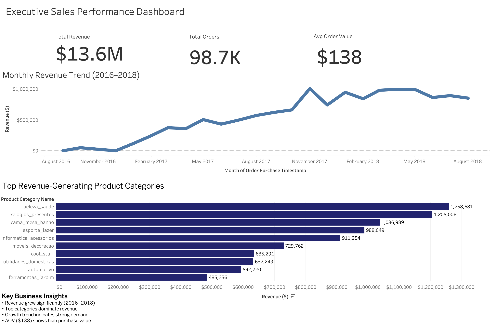

# Executive Sales Performance Dashboard | Sales & Business Analytics

# Executive Summary

## Business Problem
Organizations require a centralized view of sales performance to understand revenue growth, customer purchasing behavior, and product category contribution. Without structured analytics, leadership lacks visibility into key revenue drivers and growth trends.

## Solution
Developed an executive-level Tableau dashboard using SQL-transformed transactional data to analyze revenue trends, customer purchasing behavior, and category-level performance.

## Business Impact
- Identified $13.6M total revenue across operations
- Revealed top product categories driving majority of revenue
- Identified consistent growth trend from 2016–2018
- Determined $138 Average Order Value indicating strong purchasing behavior

## Next Steps
- Customer segmentation analysis  
- Profitability analysis by category  
- Forecasting future revenue growth  
- Customer lifetime value analysis  

---

# Final Dashboard Output

---

# Business Objective

Provide leadership with a high-level view of:

- Revenue growth trends  
- Customer purchasing behavior  
- Product category performance  
- Business growth opportunities  

---

# Dataset

Real-world transactional sales dataset (Olist marketplace)

- ~100K Orders  
- ~100K Customers  
- Multi-year data (2016–2018)  
- Multiple product categories  

---

# Methodology

## SQL Analysis
- Revenue aggregation
- KPI calculations
- Time-series analysis
- Category performance analysis
- Window functions

## Excel Validation
- Data validation
- Data review

## Tableau Dashboard
- Executive KPI visualization
- Revenue trend visualization
- Category performance analysis

---

# Key Metrics

Total Revenue: $13.6M  
Total Orders: 98.7K  
Average Order Value: $138  

---

# Tech Stack

SQL (SQLite)  
Excel  
Tableau  

---

# Outcome

Developed an executive-level sales performance dashboard combining business insights and technical analytics to support data-driven decision-making.

